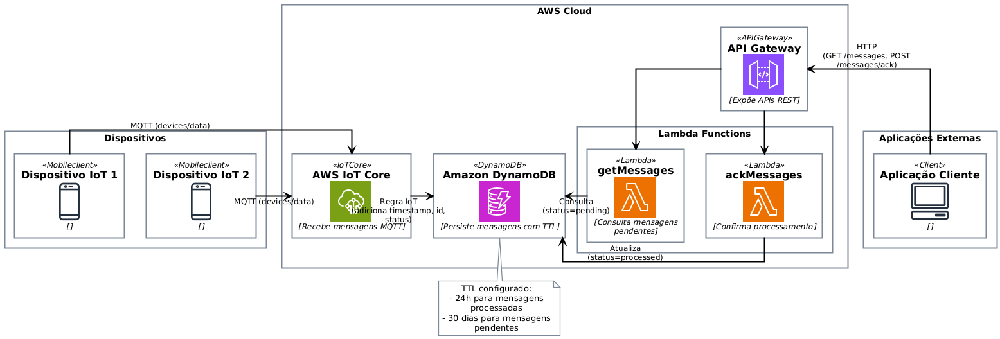

# IoT Core Example

Projeto de demonstração para processamento de mensagens MQTT com persistência em DynamoDB e API para consulta.

## Arquitetura



1. **AWS IoT Core** - Recebe mensagens MQTT dos dispositivos
2. **AWS IoT Rule** - Processa mensagens e adiciona timestamp
3. **Amazon DynamoDB** - Persiste mensagens com TTL configurado
4. **AWS Lambda** - Funções para consultar e confirmar processamento de mensagens
5. **Amazon API Gateway** - Expõe APIs para aplicações externas

## Funcionalidades

- Recebimento e persistência de mensagens MQTT
- Adição automática de timestamp e ID único
- Consulta de mensagens não processadas
- Confirmação assíncrona de processamento
- TTL agressivo para mensagens processadas (24h)
- TTL estendido para mensagens pendentes (30 dias)

## Estrutura do Projeto

```
/
├── cdk/                  # Infraestrutura como código (AWS CDK)
├── lambda/               # Funções Lambda
│   ├── getMessages/      # Consulta mensagens pendentes
│   └── ackMessages/      # Confirma processamento de mensagens
├── scripts/              # Scripts úteis
│   └── publish-test.js   # Publica mensagens de teste
└── docs/                 # Documentação
```

## Instruções de Uso

### Pré-requisitos

- Node.js 14+
- AWS CLI configurado
- AWS CDK instalado (`npm install -g aws-cdk`)

### Implantação

1. Instalar dependências:
   ```
   npm install
   ```

2. Implantar a infraestrutura:
   ```
   cdk deploy
   ```

3. Testar publicação de mensagens:
   ```
   node scripts/publish-test.js
   ```

4. Consultar mensagens via API:
   ```
   curl https://<api-id>.execute-api.<region>.amazonaws.com/prod/messages
   ```

5. Confirmar processamento:
   ```
   curl -X POST -H "Content-Type: application/json" \
     -d '{"messageIds": ["id1", "id2"]}' \
     https://<api-id>.execute-api.<region>.amazonaws.com/prod/messages/ack
   ```
